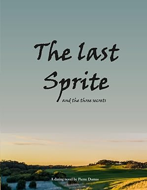
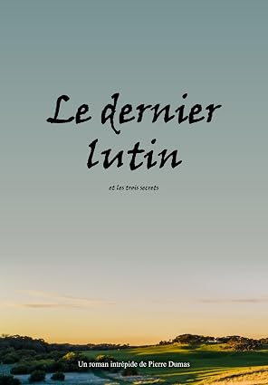

  Know your History.
  (it's key to understand who you are).

  Own your History.
  (chose your sources... History can be told in many ways).

  Don't let History own you.
  (when stories own you, people with other stories threaten your identity, then your world becomes polarized and violent).

 

  I need your support to keep the service running, 
  (otherwise I need a real job...Hire me? hire@wikitime.org)
   
  Donators get: 
  * their life timebox in the hall of fame 
  * access pro features 
  * access to games 
  * more to come... 

[[Donate]](https://ko-fi.com/wikitime)

 

  You can also support me, buying my novel
  it's a fun adventure (cherry on the cake: it helps understand who you are).

  

    
    <a class="cta" href="https://www.amazon.com/last-sprite-three-secrets/dp/B0H23LPC34" target="_blank" rel="noopener noreferrer">English version</a>
  

  

    
    <a class="cta" href="https://www.amazon.com/dernier-Lutin-French-Pierre-Dumas-ebook/dp/B0H2471PJ6" target="_blank" rel="noopener noreferrer">Version française</a>
  

   Last, it helps incredibly when you share the app 
  TODO insert here links to social networks + email TODO

